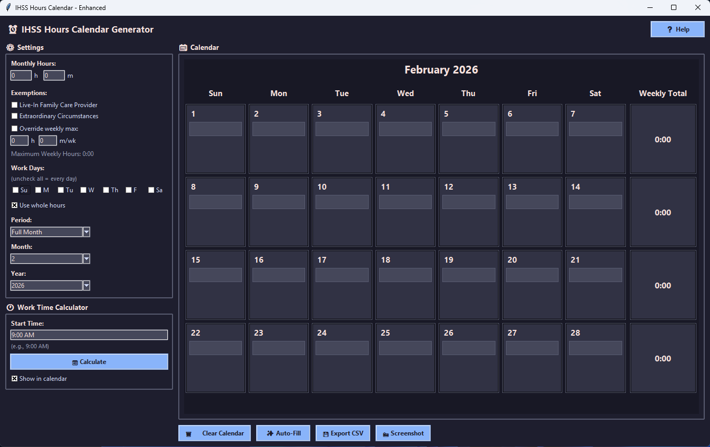

# IHSS Hours Calendar Generator

A modern, dark-themed calendar application for IHSS (In-Home Supportive Services) caregivers to manage and track their work hours efficiently.



## Features

### 📅 Calendar Management
- Interactive monthly calendar with customizable pay periods
- Support for full month or split pay periods (1-15, 16-end)
- Color-coded weekly totals (green indicators)
- Real-time hour tracking and validation

### ⏰ Work Time Calculator
- Calculate end times based on start time and daily hours
- Display finish times directly in calendar
- Supports both 12-hour (AM/PM) and 24-hour time formats

### ✨ Auto-Fill
- Automatically distribute authorized hours across selected workdays
- Option to use whole hours for cleaner scheduling
- Customizable workday selection (Sun-Sat)

### 🎯 Exemptions Support
- Live-In Family Care Provider exemption
- Extraordinary Circumstances exemption
- Custom weekly hour override option

### 💾 Export & Screenshot
- Export timesheets to CSV format
- Take screenshots of calendar for visual reference
- Timestamped filenames for easy organization

### 🎨 Modern UI
- Dark theme (easy on the eyes)
- Clean, professional interface
- Large, readable text and input fields
- Responsive layout

### ❓ Built-in Help
- Comprehensive help documentation
- Feature explanations and tips
- Usage guidelines

## Download & Installation

### Option 1: Download Executable (No Python Required)
**For Windows Users:**
1. Go to the [Releases](https://github.com/yourusername/ihss-calendar/releases) page
2. Download `IHSS_Calendar_Generator.exe`
3. Double-click to run - no installation needed!

### Option 2: Run from Source (Python Required)
**Requirements:**
- Python 3.8 or higher
- pip (Python package manager)

**Installation:**
```bash
# Clone the repository
git clone https://github.com/yourusername/ihss-calendar.git
cd ihss-calendar

# Install dependencies
pip install -r requirements.txt

# Run the application
python ihsscalculator_enhanced.py
```

## Building the Executable Yourself

If you want to build the executable from source:

**Windows:**
```batch
build.bat
```

**Linux/Mac:**
```bash
chmod +x build.sh
./build.sh
```

The executable will be created in the `dist/` folder.

## Usage Guide

### Getting Started
1. **Set Monthly Hours**: Enter your authorized monthly hours and minutes
2. **Select Exemptions**: Check any applicable exemptions (if applicable)
3. **Choose Workdays**: Select which days you work (leave unchecked for all days)
4. **Select Period**: Choose Full Month or Pay Period 1/2
5. **Auto-Fill or Manual Entry**: 
   - Click "Auto-Fill" to automatically distribute hours
   - Or manually enter hours in each day's cell

### Work Time Calculator
1. Enter your typical start time (e.g., "9:00 AM")
2. Click "Calculate" to see when you'll finish each day
3. End times appear below daily hours in the calendar

### Exporting Data
- **CSV Export**: Click "Export CSV" to save timesheet data
- **Screenshot**: Click "Screenshot" to capture calendar image

### Input Formats
Hours can be entered as:
- Whole numbers: `8` (8 hours)
- Decimals: `8.5` (8.5 hours)
- Time format: `8:30` (8 hours 30 minutes)

## Tips

✅ Always verify your schedule matches actual hours worked  
✅ Use Export CSV to keep records of your timesheets  
✅ Use Screenshot for visual reference when filling out official forms  
✅ Weekly maximum calculations are helpers - follow official IHSS guidelines  
✅ You can mix manual entry with auto-fill by clearing specific days  

## Technical Details

**Built with:**
- Python 3.x
- Tkinter (GUI framework)
- Pillow (screenshot functionality)

**Compatible with:**
- Windows 10/11
- macOS 10.14+
- Linux (Ubuntu 20.04+)

## Disclaimer

This is a personal scheduling and calculation tool. Always bill ONLY hours actually worked and follow IHSS rules and laws. The maximum weekly calculation is a simple helper and may not match every IHSS situation. Use official IHSS guidance when in doubt.

## License

MIT License - see LICENSE file for details

## Support

For issues, questions, or feature requests, please open an issue on GitHub.

## Contributing

Contributions are welcome! Please feel free to submit a Pull Request.

## Changelog

### Version 1.0.0
- Initial release
- Calendar management with pay period support
- Work time calculator
- Auto-fill functionality
- CSV export and screenshot features
- Dark theme UI
- Comprehensive help system

---

**Made with ❤️ for IHSS caregivers**
